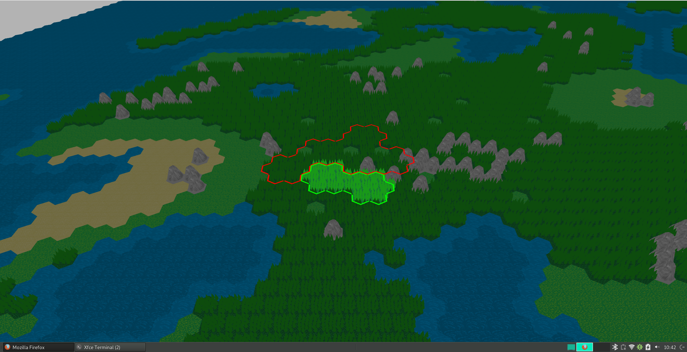

# A perlin-noise based hexagonal map generator

## How to run:
- Open index.html in your browser

## Hotkeys:
- M to show the whole map
- G to display a grid
- P to change player view
- F to toggle forests
- H to toggle mountains
- . to change "character"
- WASD to walk
- B to build

## Screenshots:

